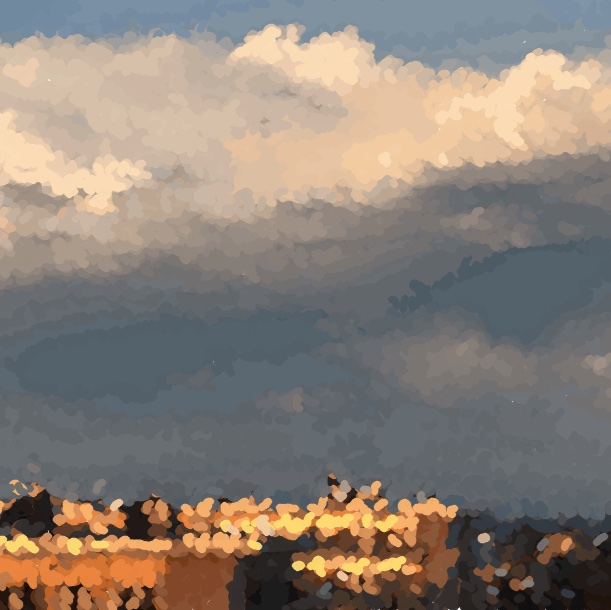
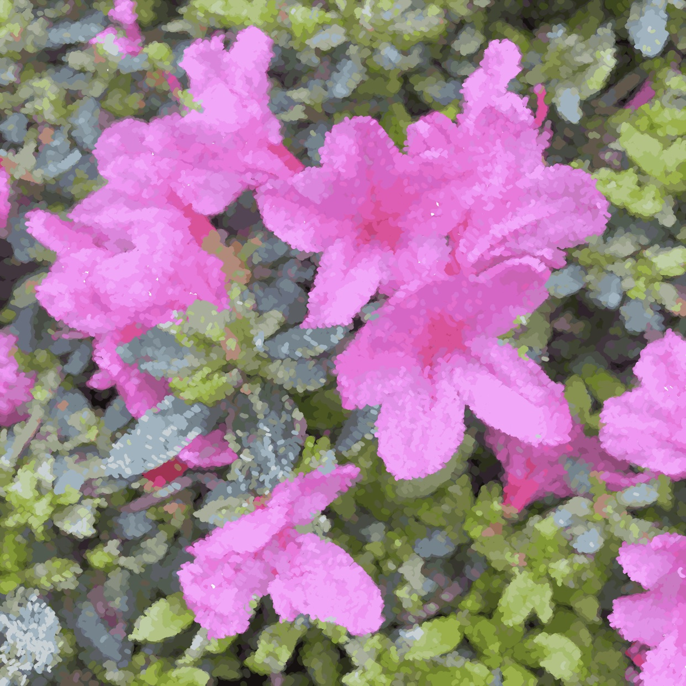
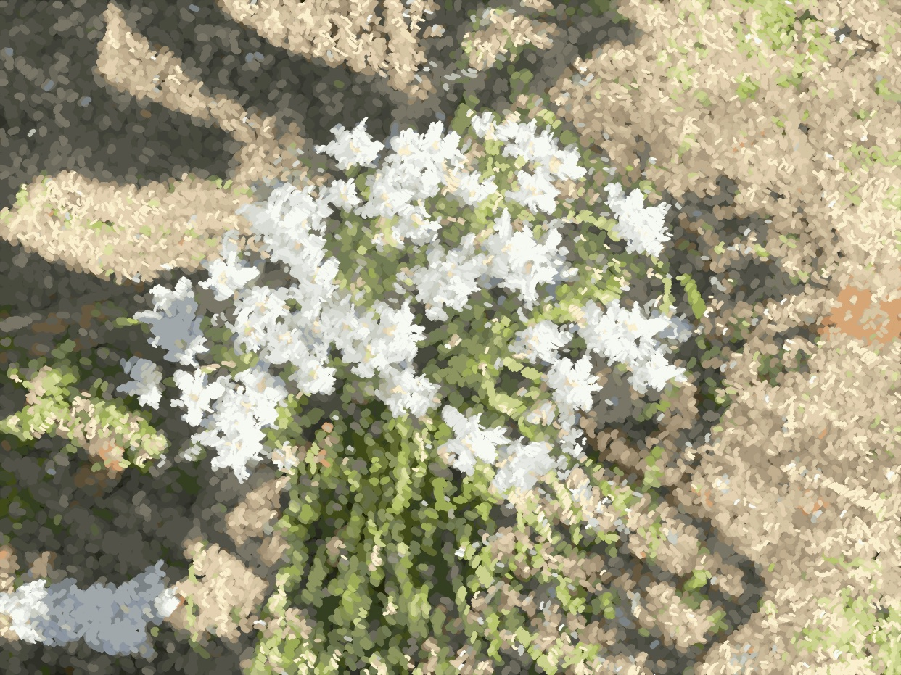
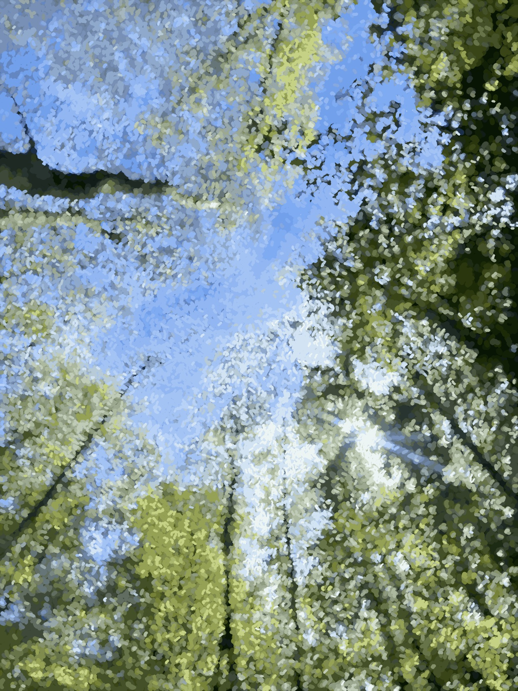
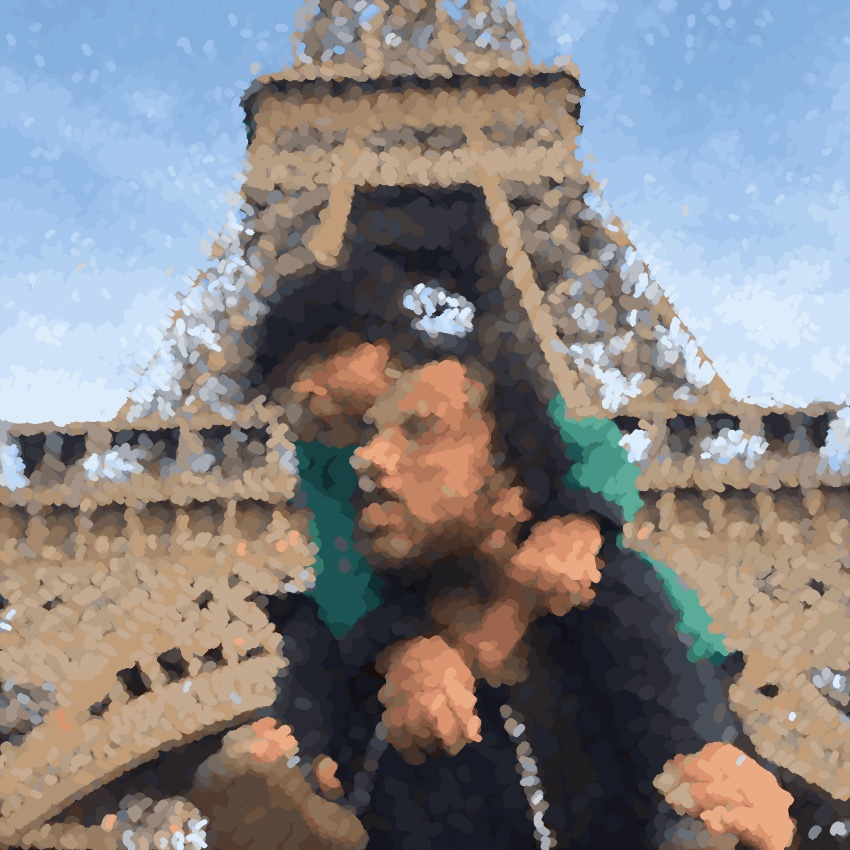

> **Note:** This is a read-only documentation mirror for **Loomflow**.
> The full source code and active development happen in a private repository.

---

# 🎨 LoomFlow

**Turn any photo into beautiful, organic brush strokes.**

Flowing. Artistic. Direction-aware.  
Variable-width strokes that follow color, light, and form — perfect for digital art or physical pen plotters.

**Available on iPhone, iPad & Mac** (Universal — buy once, use everywhere)

---

## ✨ Core Features

- 🎨 Automatic palette extraction
- 🧭 Structure tensor direction field
- ▶️ Real-time animated preview
- 🎲 Random + Importance seeding
- 📊 Coverage-based rendering
- 🌈 **Palette-aware color variation** in flat areas (optical texture, no new colors)
- 🖌️ Manual palette editing *(Pro)*
- 🧱 Smart Layers *(Pro)*
- 📦 Batch processing *(Pro)*

## 📤 Export Options

- 🖼️ Still image (screen or high-res printable)
- 🎞️ Animated video / GIF of the drawing process
- 📐 SVG
- 🖨️ G-code *(Pro)*

## 🖼️ Examples

### Skies

| Dramatic Sky | Soft Pastel Sky |
|--------------|-----------------|
|  |  |

### Flowers

| Vibrant Pink Flowers | White & Yellow Flowers |
|----------------------|------------------------|
|  |  |

### Nature & Portrait

| Forest Canopy | Portrait |
|---------------|----------|
|  |  |

## 🛠 Tech Stack

- **Core**: C++ + OpenCV
- **iOS + macOS**: Swift + Metal

---

## 📚 Documentation

For more details, see:

- [Current Pipeline](docs/current_pipeline.md) — Actual implementation flow
- [Next Steps](docs/next-steps.md) — Target modular architecture (Phase 0 + Phase 1)
- [Roadmap](docs/roadmap.md) — Development progress and plans
- [Architecture Overview](docs/architecture.md) — High-level system design

---

## 🚀 Building the Core (Phase 1)

This repo contains the C++ core algorithm.

### Prerequisites
- CMake ≥ 3.20
- OpenCV 4.x (recommended: `brew install opencv`)

### Build

```bash
mkdir build && cd build
cmake .. -DCMAKE_BUILD_TYPE=Release
cmake --build . --parallel
```

### Run the CLI test harness

```bash
./loomflow_cli /path/to/image.jpg output_mask.png
```

### Building with a local/prebuilt OpenCV

If you compiled OpenCV yourself or are using a prebuilt version, point CMake at it:

```bash
cmake .. -DOpenCV_DIR=/path/to/your/opencv/build
cmake --build . --parallel
```

### Alternative: Older Precompiled OpenCV

We support OpenCV ≥ 4.5. If you're using an older prebuilt, point CMake at it with `-DOpenCV_DIR=...`.